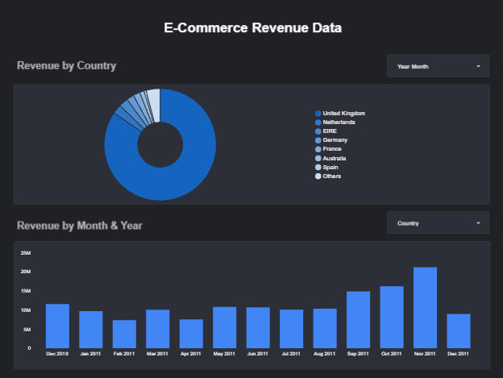

# E-Commerce Revenue Data

## Final Dashboard

## Data Source
[E-Commerce Data from Kaggle](https://www.kaggle.com/datasets/carrie1/ecommerce-data)

## Problem Statement
Identify the revenue data of an e-commerce store by country and by month and year

## Project Structure