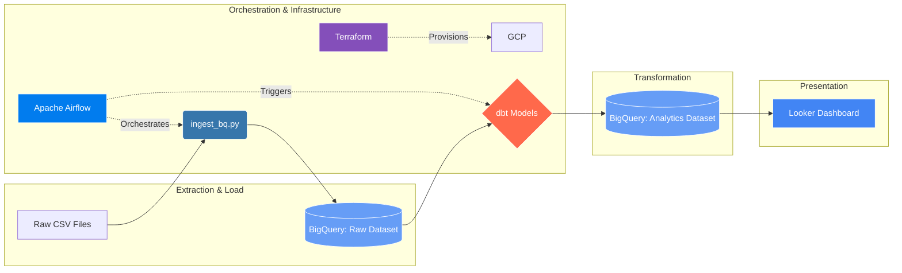

# E-Commerce Revenue Data


> An automated ELT pipeline that extracts daily retail data, loads it into a data warehouse, and transforms it into analytics-ready models.




## Final Dashboard
[](https://lookerstudio.google.com/reporting/17ed0c92-35b6-4e93-8588-0c55e4780d37)

## Data Source
[E-Commerce Data from Kaggle](https://www.kaggle.com/datasets/carrie1/ecommerce-data)

## Problem Statement
**Objective**: The goal of this project is to provide a scalable, automated solution for analyzing global e-commerce performance. Currently, raw transaction data is stored in disconnected CSV files, making it difficult for stakeholders to identify revenue trends by geographic region and time.

**Key Business Questions**:
- Which countries are the top contributors to total revenue?
- How does monthly revenue trend throughout the year (identifying seasonality)?
- Can we automate the ingestion and cleaning process to ensure data consistency?

**Solution**:
A batch-processed data pipeline that automates the extraction of CSV data, transforms it within a BigQuery Data Warehouse using dbt, and visualizes the results in a Looker Studio dashboard.

## Project Structure
```text
.
├── Makefile                           # Command shortcuts (make local-up)
├── README.md                          # Main project documentation
├── airflow/                           # Airflow orchestration environment
│   ├── dags/                          # Pipeline definition files (DAGs)
│   ├── plugins/                       # Custom Airflow operators and hooks
│   ├── requirements.dev.txt           # Local Airflow dependencies
│   └── requirements.txt               # Production Airflow dependencies
├── data/                              # Local data storage
│   └── raw/                           # Raw CSV files (ignored in git)
├── dbt/                               # Data transformation layer
│   ├── dbt_project.yml                # Main dbt configuration file
│   ├── ingest.py                      # Python extraction script
│   ├── ingest_bq.py                   # Python BigQuery loading script
│   ├── models/                        # SQL transformation models
│   ├── profiles.yml                   # dbt connection profiles
│   ├── requirements.dev.txt           # Local dbt dependencies
│   ├── requirements.txt               # Production dbt dependencies
│   ├── target/                        # Compiled dbt output (ignored in git)
│   └── tests/                         # Custom data quality tests
├── docker/                            # Containerization setup
│   ├── airflow/                       # Custom Airflow Dockerfile
│   ├── dev/                           # Local docker-compose configuration
│   └── prod/                          # Prod docker-compose configuration
├── looker/                            # Business Intelligence (BI) layer
│   ├── README.md                      # Dashboard documentation
│   └── image.png                      # Screenshot of final Looker dashboard
├── sa_terraform_admin.json            # GCP Credentials (ignored in git)
└── terraform/                         # Infrastructure as Code (IaC)
    ├── main.tf                        # Primary GCP infrastructure definition
    ├── outputs.tf                     # Variables exported after deployment
    └── variables.tf                   # Input variables for Terraform
```

## Setup Instructions
*Note: Make sure to install Docker first. See installation instruction [here](https://docs.docker.com/engine/install/).*

**Local Setup**
1. Create a `.env.local` file in the root with the following keys
- `POSTGRES_USER`: your postgres service account username
- `POSTGRES_PASSWORD`: your postgres service account password
- `POSTGRES_DB`: name of database
- `POSTGRES_HOST`: value should be `postgres`
- `POSTGRES_PORT`: port to be forwarded, default is `5432`
- `PGADMIN_EMAIL`: your preferred pgAdmin UI username
- `PGADMIN_PASSWORD`: your preferred pgAdmin UI password
2. Run `make local-up` to start the local containers.
3. Optional cleanup: run `make local-down`.

**Cloud Setup**
1. Create a GCP project.
2. Under the project, create a Service Account. Grant it the **BigQuery Admin** role. 
3. Download the keyfile in JSON. Rename it to `sa_terraform_admin.json` and move it to the root.
4. Create a `.env` file in the root with the following keys:
- `GCP_KEYFILE`: the keyfile name including the file extension
- `GCP_PROJECT_ID`: your GCP project ID
- `GCP_REGION`: your GCP project's region
5. Run `make prod-up` to deploy the cloud infrasture.
6. Optional: run a manual DAG trigger in Airflow UI.
6. Optional cleanup: run `make prod-down`.
